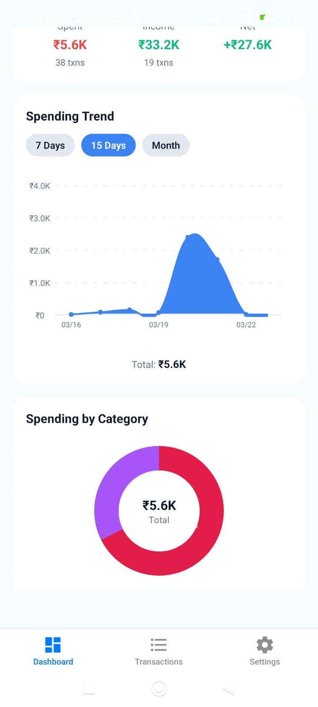
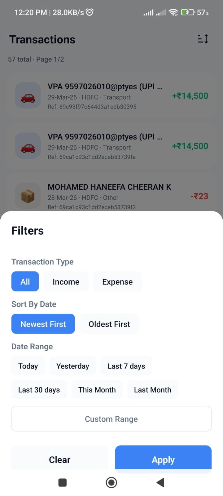
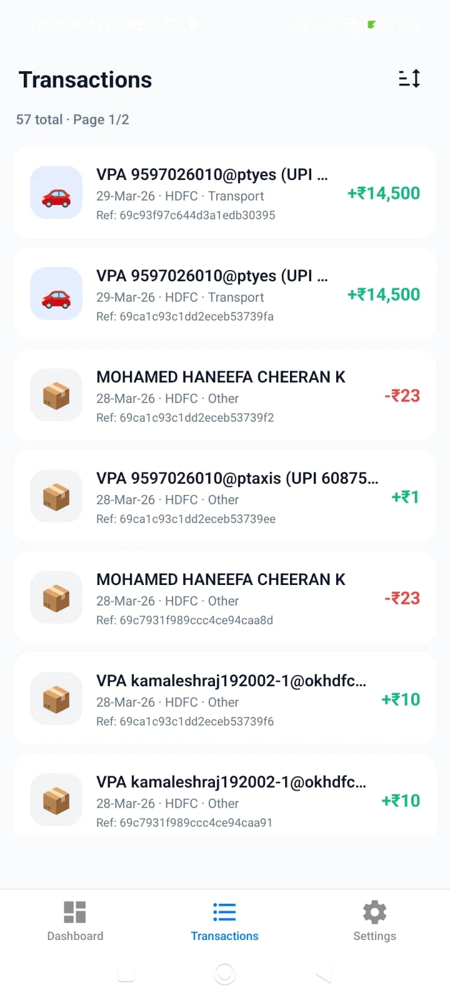
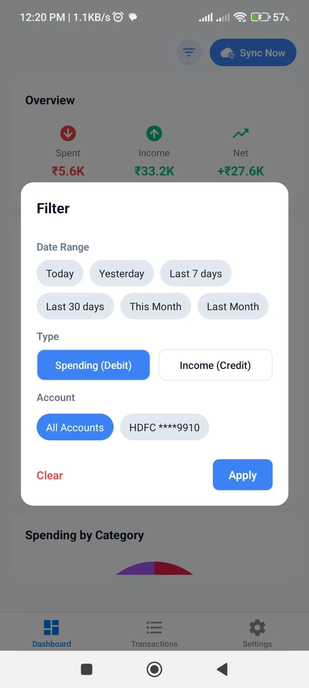

<!-- PROJECT NAME -->

<div align="center">
  
  <h1>BankSmsTracker</h1>
  <p>Automatic expense tracking from bank SMS</p>
</div>

---

## About

BankSmsTracker is a mobile app that automatically tracks your expenses by reading bank transaction SMS messages. No need to manually enter every transaction - just link your bank account and let the app do the rest.

### Why BankSmsTracker?

Traditional expense tracking apps require you to manually enter every transaction - even your daily tea shop purchase takes 2-5 minutes to log. BankSmsTracker solves this problem by automatically reading your bank SMS messages to track income and expenses.

### Key Features

- **Automatic Tracking** - Reads bank SMS to automatically track transactions
- **Bank Account Separation** - Add multiple bank accounts and track money by account
- **Smart Filtering** - Filters out OTPs, promotional messages, and personal SMS
- **Visual Reports** - Beautiful charts showing income and expenses
- **Offline Support** - Works offline with local SQLite storage
- **Background Sync** - Automatically syncs transactions in background

---

## Tech Stack

### Frontend
- **React Native** with Expo
- **TypeScript**
- **Expo Router** for navigation
- **SQLite** for local storage
- **Gifted Charts** for visualization
- **React Native Get SMS Android** for SMS reading

### Backend
- **Node.js** with Azure Functions
- **MongoDB** for database
- **JWT** for authentication

### Infrastructure
- **Azure** (Functions, Cosmos DB/MongoDB, Storage)
- **Terraform** for infrastructure as code

---

## Screenshots

| | | | |
|:---:|:---:|:---:|:---:|
|  |  |  |  |

---

## Prerequisites

- Node.js 18+
- npm or yarn
- Azure account (for backend)
- MongoDB (local or Atlas)
- Android device or emulator (for SMS reading)

---

## Project Structure

```
expense-tracker/
├── app/                 # React Native frontend (Expo)
│   ├── src/
│   │   ├── services/   # Business logic services
│   │   ├── utils/       # Utility functions
│   │   ├── hooks/       # React hooks
│   │   ├── types/       # TypeScript types
│   │   └── constants/   # App constants
│   └── assets/          # Images, fonts, etc.
├── backend/             # Node.js Azure Functions
│   ├── src/
│   │   ├── functions/  # Azure Functions
│   │   ├── models/     # MongoDB models
│   │   ├── utils/      # Utility functions
│   │   └── middleware/ # Express middleware
│   ├── openapi.yaml     # API documentation (OpenAPI 3.0)
│   └── local.settings.json
├── infra/               # Terraform configuration
│   ├── variables.tf
│   ├── terraform.tfvars
│   └── *.tf
└── README.md
```

---

## Getting Started

### 1. Clone the Repository

```bash
git clone <repository-url>
cd expense-tracker
```

### 2. Frontend Setup (React Native)

```bash
cd app

# Install dependencies
npm install

# Start the development server
npm start

# Run on Android
npm run android
```

#### Required Environment Variables

Create a `.env` file in `app/` directory:

```env
API_BASE_URL=http://localhost:7071/api
```

### 3. Backend Setup (Azure Functions)

```bash
cd backend

# Install dependencies
npm install
```

#### Configuration Files

Create `backend/local.settings.json`:

```json
{
  "IsEncrypted": false,
  "Values": {
    "AzureWebJobsStorage": "<your-azure-storage-connection-string>",
    "FUNCTIONS_WORKER_RUNTIME": "node",
    "MONGO_URI": "<your-mongodb-uri>",
    "MONGO_DB": "expensetracker",
    "JWT_SECRET": "<your-jwt-secret>"
  }
}
```

**Required Configuration Values:**

| Variable | Description |
|----------|-------------|
| `AzureWebJobsStorage` | Azure Storage connection string for Azure Functions |
| `FUNCTIONS_WORKER_RUNTIME` | Set to `node` |
| `MONGO_URI` | MongoDB connection string (e.g., `mongodb+srv://...`) |
| `MONGO_DB` | Database name (e.g., `expensetracker`) |
| `JWT_SECRET` | Secret key for JWT token generation |

#### Run Backend Locally

```bash
cd backend
npm start
```

The API will be available at `http://localhost:7071/api`

### 4. Infrastructure Setup (Terraform)

Navigate to the infra directory and configure:

```bash
cd infra
```

Create or update `terraform.tfvars`:

```hcl
# Resource naming prefix
prefix = "exptracker"

# MongoDB Configuration
mongo_uri = "mongodb+srv://<username>:<password>@cluster.mongodb.net/?retryWrites=true&w=majority"
mongo_db  = "expensetracker"

# Azure Configuration
port                  = "8080"
NODE_ENV              = "production"
CLIENT_JWT_SECRET     = "<your-secure-jwt-secret>"
AZUREAD_APP_TENANT_ID = "<your-azure-tenant-id>"
AZURE_SUBSCRIPTION_ID = "<your-azure-subscription-id>"
```

**Initialize and apply Terraform:**

```bash
terraform init
terraform plan
terraform apply
```

---

## API Documentation

The API is fully documented using OpenAPI 3.0. View the specification at:
**`backend/openapi.yaml`**

You can import this file into tools like:
- [Swagger Editor](https://editor.swagger.io/)
- [Postman](https://www.postman.com/)
- VS Code OpenAPI extension

Or serve it locally using:
```bash
npx swagger-editor-openapi3-server backend/openapi.yaml
```

## API Endpoints

### Authentication
- `POST /api/auth/register` - Register new user
- `POST /api/auth/login` - Login user

### Transactions
- `GET /api/transactions` - Get all transactions
- `POST /api/transactions` - Create transaction
- `PUT /api/transactions/:id` - Update transaction
- `DELETE /api/transactions/:id` - Delete transaction

### Accounts
- `GET /api/accounts` - Get all accounts
- `POST /api/accounts` - Create account
- `PUT /api/accounts/:id` - Update account
- `DELETE /api/accounts/:id` - Delete account

### Statistics
- `GET /api/statistics/summary` - Get expense/income summary
- `GET /api/statistics/category` - Get category-wise breakdown

---

## Supported Banks

The app currently supports parsing SMS from:
- HDFC Bank
- Kotak Mahindra Bank
- ICICI Bank
- State Bank of India (SBI)
- Axis Bank
- Yes Bank
- IndusInd Bank
- Punjab National Bank
- Indian Bank
- IOB

More banks can be added by extending the parser in `app/src/utils/smsParser.ts`.

---

## Security Features

- **JWT Authentication** - Secure API access
- **Smart SMS Filtering** - Automatically filters out:
  - OTP messages
  - Promotional offers
  - Credit card offers
  - Personal messages
- **Local Storage** - Transaction data stored locally first
- **HTTPS** - All API calls use HTTPS in production

---

## Permissions

### Android Permissions
- `READ_SMS` - Read bank transaction messages
- `RECEIVE_SMS` - Receive SMS (for future features)
- `RECEIVE_BOOT_COMPLETED` - Start background sync on device boot
- `FOREGROUND_SERVICE` - Background sync service

---

## Contributing

1. Fork the repository
2. Create your feature branch (`git checkout -b feature/amazing-feature`)
3. Commit your changes (`git commit -m 'Add some amazing feature'`)
4. Push to the branch (`git push origin feature/amazing-feature`)
5. Open a Pull Request

---

## License

MIT License - see LICENSE file for details

---

## Acknowledgments

- Expo team for the amazing React Native framework
- MongoDB for the flexible database
- Azure for cloud infrastructure
